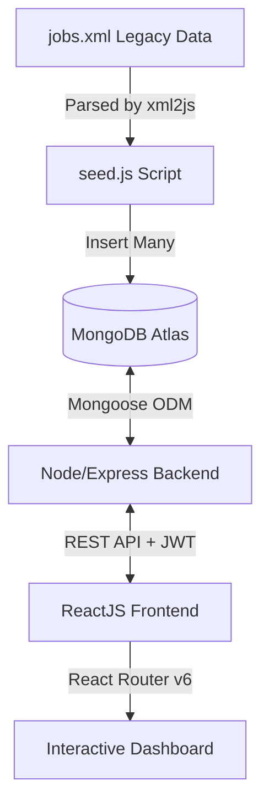

# ICT ACADEMY OF KERALA
## Summer Internship Report

# Full Stack Application Development with ReactJS
**Project:** Development of a Modern MERN-based Job Portal System

---

**Name of Team Members:** Student Intern (MERN Stack Track)  
**Name of Your Institution:** ICT Academy of Kerala  
**Date:** 22.06.2026

---

## EXECUTIVE SUMMARY

This internship report details the comprehensive design, system architecture, and development of a **Full-Stack Job Portal Application** built using **React.js**, **Node.js/Express**, and **MongoDB Atlas**, incorporating an **XML-based legacy data migration** mechanism. The project addresses the contemporary challenges of digital recruitment by building a high-performance, secure, and user-centric platform.

The primary objective of the project was to construct a responsive, dual-role career platform that serves two primary stakeholders with distinct, specialized workflows:
* **Job Seekers** are provided with a complete suite of search, retrieval, and status tracking features. Upon secure registration and login, seekers can browse a dynamic repository of job listings, applying multi-dimensional filters including keyword search (matching titles or companies), industrial category selection, geographic location constraints, and job type classifications. To streamline the application process, seekers can bookmark listings via a local save mechanism, submit applications through an interactive form that handles candidate metadata, upload resume files strictly validated in PDF format, and track real-time changes in their application status (from *Pending* to *Approved* or *Rejected*) through a dedicated notification dashboard.
* **Employers** are granted comprehensive administrative privileges to manage talent acquisition. They can create, edit, or delete job listings through specialized dashboard forms, monitoring the system metrics. When candidates submit applications, employers have access to a secure submissions interface where they can review candidate profiles, download submitted PDF resumes, and immediately update application statuses, triggering real-time notification alerts for the applicants.

Architecturally, the project follows a decoupled client-server model, ensuring a clear separation of concerns. 
* On the frontend, **React Router v6** is utilized to establish an intuitive URL-driven routing system that synchronizes the address bar with the rendered components, eliminating unnecessary page refreshes. Native React Hooks (`useState`, `useEffect`, `useCallback`) are employed for state propagation and optimization of event handlers. Communication with the backend is managed via an asynchronous HTTP query module that appends authorization headers dynamically.
* The backend is powered by a stateless **Node.js/Express** API server connected to a cloud-hosted **MongoDB Atlas** database. Data modeling is enforced using **Mongoose** schemas for users, listings, and applications. Security is handled using **bcryptjs** for hashing user passwords and stateless **JSON Web Tokens (JWT)** to manage session authorization securely. Binary resume files are processed on the server using **Multer** middleware, validating MIME types and file size boundaries. 
* To integrate legacy data sources, an XML parser script (`seed.js` using the `xml2js` library) was designed to ingest hierarchical job records from a localized `jobs.xml` database seed, converting and saving them to the MongoDB cluster. 

The resulting system delivers a premium user experience featuring light/dark theme persistence via `localStorage`, smooth transition animations, and a background polling mechanism that synchronizes notification status updates.

---

## INTRODUCTION

Online job boards and career portals have evolved from basic digital bulletin boards into critical socio-technical infrastructure in the modern global recruitment ecosystem. For job seekers, these platforms act as highly centralized, intelligent hubs that eliminate geographic and informational barriers, allowing them to search for diverse career tracks, apply granular filters, bookmark matches, and submit applications with a single click. For employers and talent acquisition teams, career portals are vital administrative assets that automate the collection of resume attachments, streamline candidate pipelines, and optimize applicant tracking systems (ATS) through automated indexing.

From a software engineering perspective, designing, building, and deploying a secure, responsive, and data-portable career platform involves overcoming several significant architectural challenges:
1. **Dynamic Search and Real-Time Filtering:** In a high-traffic environment, job seekers demand instantaneous, low-latency feedback when applying filters (such as work category, job type, location, and keywords). Managing these queries efficiently requires a robust data query layer. If filters are executed sequentially or require full page loads, database locks or significant network congestion can result. Resolving this necessitates client-side state optimization coupled with parameterized database searches.
2. **Role-Based Workflows and Security Isolation:** A unified platform must manage distinct access control levels (ACL) for employers and job seekers. Job seekers must not have the ability to view admin screens, edit job postings, or manipulate candidate applications. Conversely, employers need access to administrative tools to create, read, update, and delete (CRUD) their own job listings while protecting applicant data from other companies. The system must verify these roles on both the client (for visual routing) and the server (for secure endpoint verification).
3. **Stateless Authentication and Session Scalability:** Traditional session-based authentication relies on server memory to track logged-in users, which hampers horizontal scalability. Modern decoupled applications connect client-side Single Page Applications (SPAs) to server-side REST APIs using stateless token architectures. Under this model, the server issues a signed web token containing role and identification metadata. The client stores this token locally and transmits it in the Authorization header of subsequent requests, ensuring secure access without server-side state.
4. **Data Portability and Heterogeneous Data Integration:** Legacy recruitment systems often store datasets in hierarchical text formats like XML. When modernizing these systems to NoSQL databases, developers must build data migration pipelines. The system must read unstructured or semi-structured data, map and validate schemas, and write the normalized data to the database without data loss.

This project addresses these challenges by implementing a decoupled, responsive web application structure. The backend operates as a stateless API server built on Node.js/Express, connected to a cloud-based **MongoDB Atlas** database via the Mongoose ODM, while the frontend is built as a client-side React SPA. By using **React Router v6**, client-side state is tied directly to browser URLs. This allows users to bookmark specific pages and use browser history navigation. A custom seeding workflow parses `jobs.xml` into MongoDB, creating a hybrid database initialization process.

---

## OBJECTIVES

The core objectives of this project were to design, architect, and implement a fully functioning, production-ready Job Portal while acquiring industry-relevant skills in full-stack JavaScript development. The specific objectives include:

1. **Mastering Client-Side Routing and Single-Page Application (SPA) Paradigms:** Developing an intuitive, declarative, URL-driven routing system using **React Router v6** to manage client-side state transitions without trigger-loading full HTML files from the server. This included utilizing specialized hooks such as `useNavigate` for programmatic redirections, `useParams` for parsing dynamic URL parameters (such as job and application IDs), and `<NavLink>` with active CSS class mappings to provide immediate visual feedback.
2. **Building Scalable RESTful API Architecture:** Designing Express.js router modules that follow RESTful API standards. The objective was to construct endpoints for executing CRUD operations on job documents, handling user session verification, and processing application objects. This required implementing standard HTTP verbs (`GET`, `POST`, `PUT`, `DELETE`, `PATCH`), utilizing appropriate HTTP status codes (such as `200 OK`, `201 Created`, `400 Bad Request`, `401 Unauthorized`, `404 Not Found`, and `500 Internal Server Error`), and organizing modular routers to keep the codebase maintainable.
3. **Data Modeling and Persistence with NoSQL Databases:** Gaining proficiency in document-oriented database design using **MongoDB Atlas** and the **Mongoose ODM**. The objective was to design schemas for the `User`, `Job`, and `Application` collections, defining validation rules, default fields, virtual references, and cascade-deletion strategies. Furthermore, the goal was to write query filters (using operators like `$regex`, `$options`, and `$or`) to support real-time searches and category filters.
4. **Implementing Safe Binary File Upload Pipelines:** Configuring **Multer** middleware to parse multi-part form requests (`multipart/form-data`) and process binary file uploads securely. The specific target was to restrict resume uploads exclusively to the `application/pdf` MIME type, reject files exceeding a 10MB limit, handle disk storage with unique filename hashing to prevent file collisions, and serve uploads as static assets securely.
5. **Securing API Endpoints with Stateless Token-Based Authentication:** Establishing user authentication and authorization mechanisms. This included implementing secure registration validation, password hashing using **bcryptjs** (with 10 rounds of salt generation) before database storage, and generating signed **JSON Web Tokens (JWT)** to securely transmit user roles and identifiers. The objective also involved writing token verification middleware to protect sensitive administrative actions (like posting or updating jobs) from unauthorized requests.
6. **Creating a High-Aesthetic, Dynamic User Interface:** Designing a clean dashboard using semantic HTML5 and vanilla CSS custom properties. The goal was to support dynamic themes (light and dark mode) by mapping colors to HSL palettes, saving user preferences in `localStorage`, and implementing smooth CSS transitions, interactive hover cards, and micro-animations to enhance user engagement.

---

## SCOPE AND DELIVERABLES

### 1. Scope of the Project
The project scope is defined by the capabilities provided to the two user roles:

#### A. Job Seeker Scope
* **Authentication:** Account registration and login.
* **Browse and Filter:** Real-time search by title/company, and filtering by Category (Technology, Management, Data & AI, Design, Marketing) and Type (Full-time, Part-time, Contract).
* **Job Details:** View in-depth descriptions, requirements, and benefits.
* **Save Jobs:** Bookmark listings for later retrieval.
* **Apply:** Submit candidate details along with a required PDF resume file.
* **Notifications:** Monitor status updates (Pending, Approved, Rejected) of submitted applications.

#### B. Employer Scope
* **Job Management:** Add new listings, update active postings, and delete outdated jobs.
* **Application Review:** Access a specialized dashboard to view candidate profiles, download submitted resume PDFs, and change application statuses.
* **Notifications:** Receive real-time alerts when new candidates apply to their active listings.

---

### 2. Project Deliverables
The following artifacts were successfully produced and delivered:
* **Frontend Application:** React.js source directory containing components, routing setup (`App.jsx`), global CSS variables (`global.css`), and an API request layer (`api.js`).
* **Backend API Server:** Node.js/Express application featuring router endpoints, database connection setups, and security middleware.
* **Legacy XML Dataset:** An XML file (`jobs.xml`) containing formatted initial job listings.
* **Database Seeding Script:** A Node script (`seed.js`) that parses XML data and seeds it into the MongoDB collection.
* **Database Schemas:** Mongoose models defining the structures of `User`, `Job`, and `Application` collections.

---

## METHODOLOGY

The development process followed a structured engineering lifecycle, utilizing the MERN stack with XML parsing capabilities. 



### 1. Architecture Overview
* **Client-Side:** Single Page Application (SPA) built using React. It communicates with the backend asynchronously using the browser's standard `fetch` API.
* **Server-Side:** REST API built on Express.js. It remains stateless, validating requests via JWTs sent in the `Authorization` header.
* **Database:** MongoDB Atlas, representing a cloud document store. Communication is abstracted through Mongoose models.

### 2. Key Techniques and Tools
* **Data Parsing:** The `xml2js` library was chosen to read the hierarchical XML nodes of `jobs.xml`, convert them into JSON objects, and insert them into MongoDB.
* **Authentication:** Password validation is processed using `bcryptjs` (using 10 salt rounds). Sessions are managed using JWTs signed with a secret key, set to expire in 7 days.
* **File Uploads:** Multer middleware restricts uploads exclusively to the `application/pdf` MIME type and enforces a 10MB file limit to prevent resource exhaustion.
* **Styling System:** Avoided heavy utility frameworks. Instead, a custom design system was defined in `global.css` using CSS variables. This allowed the transition between dark and light themes by modifying the `data-theme` attribute on the root HTML element.

---

## PROJECT ACTIVITIES

The development lifecycle was executed across five structured sprints:

### Sprint 1: Architecture and Database Design
* Set up directories for `backend` and `frontend`.
* Configured local environment files (`.env`) for storing MongoDB Atlas connection strings and JWT signing secrets.
* Created the Mongoose schemas:
  * **User Schema:** Tracks credentials (`email`, hashed `password`), display `name`, and account `role`.
  * **Job Schema:** Holds descriptive metadata (`title`, `company`, `location`, `salary`, `description`, `requirements`, `benefits`).
  * **Application Schema:** Associates job seekers with their applied positions, tracking resume file paths, candidate contact details, and application status.

### Sprint 2: XML Legacy Parsing and Seeding
* Created `jobs.xml` to represent legacy database job entries, organized by hierarchical XML tags (`<job>`, `<title>`, `<requirements>`, etc.).
* Coded `seed.js` using `fs` and `xml2js` to read, normalize, and load the XML records.
* Executed the script to wipe existing entries and populate the MongoDB database with a clean, standardized dataset.

### Sprint 3: Express REST API Implementation
* Implemented user registration and login endpoints in `auth.js`. Engineered an auto-registration feature: logging in with a new email automatically registers the user (defaulting to the `employer` role if the email contains the substring "employer").
* Developed Job CRUD endpoints in `jobs.js` enabling GET, POST, PUT, and DELETE actions.
* Configured the Multer storage engine in `applications.js` to rename files with unique timestamps and verify PDF extensions.
* Created application routing endpoints enabling seekers to apply, and employers to fetch submissions and update candidate statuses.

### Sprint 4: React UI and Route Integration
* Setup `App.jsx` with `<BrowserRouter>` and mapped URL patterns using React Router v6.
* Built components:
  * `JobListings.jsx`: Renders active job cards with interactive search filters.
  * `JobDetail.jsx`: Shows comprehensive details with dynamic actions (Apply, Edit, Delete, Save) based on the logged-in user's role.
  * `ApplyForm.jsx`: Gathers applicant information and submits the form data (including files) to the backend.
  * `Notifications.jsx` & `SeekerNotifications.jsx`: Separate status trackers for employer submissions and seeker applications.
  * `Auth.jsx`: Managed login and sign-up inputs.

### Sprint 5: System Polling and Polish
* Integrated a background execution loop in `App.jsx` that polls the notification endpoints every 15 seconds to update the notification badges in the navigation bar.
* Implemented light/dark modes using CSS custom properties, saving user preference in `localStorage`.
* Managed Cross-Origin Resource Sharing (CORS) configurations to allow frontend requests from `http://localhost:3000` to the Express backend running on `http://localhost:5000`.

---

## RESULTS & FINDINGS

### 1. Unified Interface and Theme Configurations
The interface uses a modern design system. In Dark Mode, a dark background (`#0f0f13`) is contrasted with vibrant accent colors (purple, teal, gold, and red). Light Mode changes to a slate-grey/white theme (`#f8fafc`). The layout remains fully responsive, adapting to mobile and desktop screens.

### 2. URL Routing Table (React Router v6)
The application utilizes declarative routing. Changing the URL dynamically renders components without reloading the browser:

| Path | Component | Auth Role | Description |
|---|---|---|---|
| `/` | Redirects to `/jobs` | All | Direct entry point |
| `/jobs` | `JobListings` | All | Browse and filter job posts |
| `/jobs/:id` | `JobDetailPage` | All | Dynamic single-job viewer |
| `/jobs/edit/:id` | `EditJob` | Employer | Update existing job details |
| `/apply/:id` | `ApplyForm` | Job Seeker | Submit contact data and PDF resume |
| `/post` | `PostJob` | Employer | Form to post new job listings |
| `/notifications` | `Notifications` | Employer | Review incoming applications |
| `/seeker-notifications` | `SeekerNotifications`| Job Seeker | Track application progress and status |
| `/login` / `/register` | `Auth` | Guest | User authentication portal |

---

### 3. Database Collection Structure
Mongoose enforces structured objects on MongoDB. Below is the document mapping:

```json
// User Document
{
  "_id": ObjectId("647a..."),
  "name": "Alex Mercer",
  "email": "alex@example.com",
  "password": "$2a$10$hashedpasswordstring...",
  "role": "jobseeker",
  "createdAt": "2026-06-22T08:15:30Z"
}

// Job Document
{
  "_id": ObjectId("647b..."),
  "title": "Senior Frontend Developer",
  "company": "TechNova Inc.",
  "location": "Bangalore, India",
  "type": "Full-time",
  "category": "Technology",
  "salary": "₹18L - ₹28L/yr",
  "logo": "TN",
  "color": "#6C63FF",
  "description": "We are looking for an experienced Frontend Developer...",
  "requirements": ["5+ years React experience", "TypeScript proficiency"],
  "benefits": ["Health insurance", "Remote work"]
}

// Application Document
{
  "_id": ObjectId("647c..."),
  "jobId": ObjectId("647b..."),
  "jobTitle": "Senior Frontend Developer",
  "company": "TechNova Inc.",
  "seekerName": "Alex Mercer",
  "seekerEmail": "alex@example.com",
  "seekerPhone": "+91 9876543210",
  "resumePath": "/uploads/1718923049-987654321.pdf",
  "status": "Pending",
  "isSeekerRead": false,
  "createdAt": "2026-06-22T08:20:15Z"
}
```

---

### 4. UI/UX Application Screenshots
Below are the key user interfaces representing the operational flows of the Job Portal. To display your screenshots in this report, save your image files (in PNG or JPG format) in the same directory as this report and name them exactly as shown below:

#### A. Job Seeker Interfaces
1. **Browse Jobs Dashboard (Dark/Light Theme):** Show the primary landing page demonstrating the grid layout of jobs, search keyword inputs, and filter selectors.
   

2. **Job Details & Application Form:** Show the page displaying job descriptions, requirements, and benefits, alongside the active submission form with candidate details and the resume PDF upload field.
   

3. **Seeker Notification Status Tracker:** Show the notification dashboard displaying alerts for approved or rejected applications.
   

#### B. Employer Administrative Interfaces
4. **Post a New Job / Edit Job Form:** Show the creation form containing input fields (Title, Company, Salary, Location, Type, Category, Description, Requirements, and Benefits).
   

5. **Employer Applications Manager Dashboard:** Show the dashboard where employers review applications, click buttons to open/download PDF resumes, and change statuses.
   

#### C. Database Verification
6. **MongoDB Atlas Database Collections:** Show a screenshot of the MongoDB Atlas cloud GUI (or MongoDB Compass) showing active entries in the `users`, `jobs`, or `applications` collections.
   

---


## CONCLUSION

The development of the MERN-based Job Portal successfully fulfilled all initial objectives. The internship provided valuable hands-on experience in building a complete full-stack project from design to implementation.

### Key Learnings:
* **React Router v6 Navigation:** Tied browser URLs to client-side page rendering. This enables proper navigation history, back/forward functionality, and bookmarking.
* **Stateless Token Authentication:** Using JWTs removes the need to store session states on the server. This makes the system more scalable.
* **Document Database Flexibility:** MongoDB's document-based storage allowed for quick schema updates when adding new attributes like requirements and benefits, compared to traditional SQL databases.
* **Data Ingestion:** Processing XML data via `xml2js` provided practice in handling legacy integration tasks.

### Future Enhancements:
1. **Real-time Communication:** Replace the 15-second polling interval with a WebSocket library like **Socket.io** to send immediate status updates.
2. **Advanced Security:** Implement token refresh cycles and role verification middleware on the server to protect administrative routes.
3. **Advanced Search:** Use MongoDB Atlas search indexes to support fuzzy search queries and relevance-based ranking.

---

## APPENDIX

### 1. Project Directory Structure
```
job-portal/
├── backend/
│   ├── models/
│   │   ├── Application.js
│   │   ├── Job.js
│   │   └── User.js
│   ├── uploads/
│   ├── .env
│   ├── applications.js
│   ├── auth.js
│   ├── jobs.js
│   ├── jobs.xml
│   ├── seed.js
│   ├── server.js
│   └── package.json
└── frontend/
    ├── public/
    ├── src/
    │   ├── components/
    │   │   ├── Applications.jsx
    │   │   ├── ApplyForm.jsx
    │   │   ├── Auth.jsx
    │   │   ├── EditJob.jsx
    │   │   ├── JobDetail.jsx
    │   │   ├── JobListings.jsx
    │   │   ├── Notifications.jsx
    │   │   ├── PostJob.jsx
    │   │   └── SeekerNotifications.jsx
    │   ├── api.js
    │   ├── App.jsx
    │   ├── global.css
    │   └── index.js
    └── package.json
```

### 2. Backend REST API Endpoints
All API calls use the base URL `http://localhost:5000/api`.

#### Authentication Endpoints (`/auth`)
* `POST /register`: Registers a new user account.
* `POST /login`: Validates user credentials, auto-creates accounts on the fly, and returns a signed JWT.

#### Job Endpoints (`/jobs`)
* `GET /`: Lists all jobs (supports query parameters: `category`, `type`, `location`, `search`).
* `GET /:id`: Retrieves detailed information for a single job posting.
* `POST /`: Creates a new job posting (requires an employer role and a valid JWT).
* `PUT /:id`: Updates an existing job posting (requires an employer role and a valid JWT).
* `DELETE /:id`: Deletes a job posting (requires an employer role and a valid JWT).

#### Application Endpoints (`/applications`)
* `POST /`: Submits a candidate application, uploading a PDF file via Multer.
* `GET /`: Lists incoming applications (requires an employer role).
* `GET /seeker`: Lists applications submitted by the logged-in seeker.
* `PATCH /:id/status`: Updates application status (Approved/Suspended/Pending) (requires an employer role).
* `PATCH /:id/read`: Marks a status notification as read by the job seeker.

---
*Report compiled for ICT Academy of Kerala by the MERN Stack Intern Team.*
